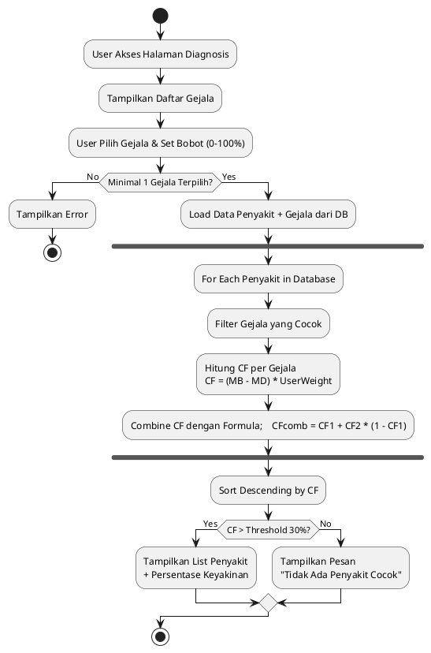
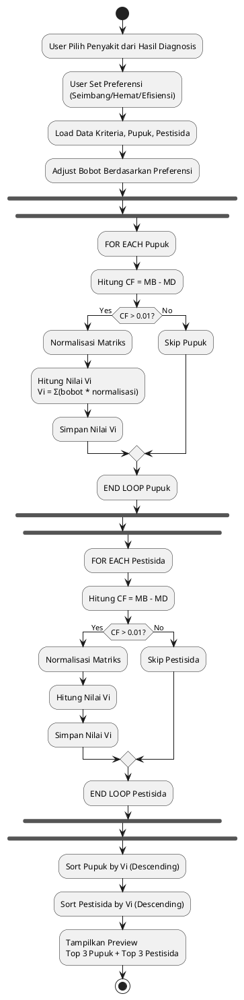
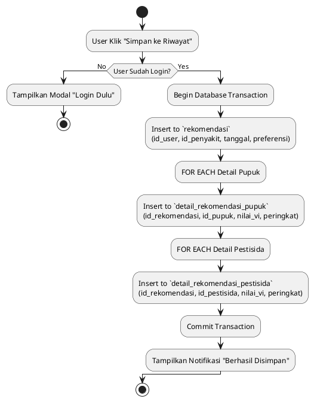
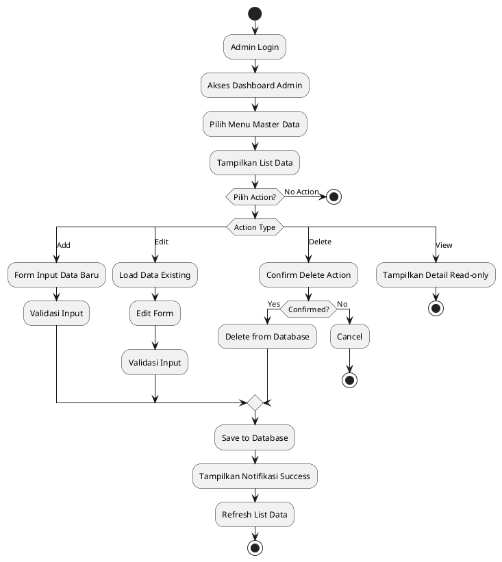
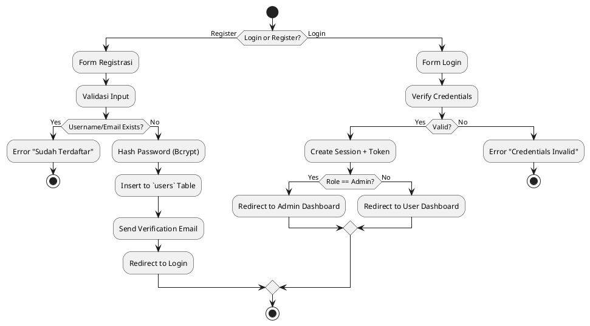

# 🔄 ACTIVITY DIAGRAM - SISTEM SPK PUPUK & PESTISIDA PADI

## 📋 DAFTAR ACTIVITY DIAGRAM

1. [Activity Diagram: Diagnosis Penyakit](#1-activity-diagram-diagnosis-penyakit)
2. [Activity Diagram: Rekomendasi Pupuk & Pestisida](#2-activity-diagram-rekomendasi-pupuk--pestisida)
3. [Activity Diagram: Simpan Riwayat](#3-activity-diagram-simpan-riwayat)
4. [Activity Diagram: Admin Kelola Master Data](#4-activity-diagram-admin-kelola-master-data)
5. [Activity Diagram: Autentikasi User](#5-activity-diagram-autentikasi-user)

---

## 1. ACTIVITY DIAGRAM: DIAGNOSIS PENYAKIT

### **Deskripsi**
Proses diagnosis penyakit padi menggunakan metode Certainty Factor berdasarkan gejala yang dipilih user.

### **Aktor**: Guest, Petani

### **Flow Proses**:

```
┌─────────────────────┐
│   START             │
└──────────┬──────────┘
           ▼
┌─────────────────────┐
│ Akses Halaman       │
│ Diagnosis           │
└──────────┬──────────┘
           ▼
┌─────────────────────┐
│ Tampilkan Daftar    │
│ Gejala (Checkbox)   │
└──────────┬──────────┘
           ▼
┌─────────────────────┐
│ User Pilih Gejala   │
│ & Set Bobot (0-100%)│
└──────────┬──────────┘
           ▼
┌─────────────────────┐
│ Validasi: Minimal   │
│ 1 Gejala Terpilih?  │
└──────────┬──────────┘
           │
     ┌─────┴─────┐
     │           │
    NO          YES
     │           │
     ▼           ▼
┌─────────┐  ┌─────────────────────┐
│ Tampil  │  │ Sistem Load Data    │
│ Error:  │  │ Penyakit + Gejala   │
│ Pilih   │  │ dari Database       │
│ Gejala  │  └──────────┬──────────┘
└────┬────┘             │
     │                  ▼
     │         ┌─────────────────────┐
     │         │ Loop: Setiap        │
     │         │ Penyakit di DB      │
     │         └──────────┬──────────┘
     │                    │
     │                    ▼
     │         ┌─────────────────────┐
     │         │ Filter Gejala yang  │
     │         │ Cocok dengan Input  │
     │         └──────────┬──────────┘
     │                    │
     │                    ▼
     │         ┌─────────────────────┐
     │         │ Hitung CF per       │
     │         │ Gejala:             │
     │         │ CF = (MB-MD)*Weight │
     │         └──────────┬──────────┘
     │                    │
     │                    ▼
     │         ┌─────────────────────┐
     │         │ Combine CF dengan   │
     │         │ Rumus Combination   │
     │         └──────────┬──────────┘
     │                    │
     │                    ▼
     │         ┌─────────────────────┐
     │         │ End Loop            │
     │         └──────────┬──────────┘
     │                    │
     │                    ▼
     │         ┌─────────────────────┐
     │         │ Sort Descending     │
     │         │ Berdasarkan CF      │
     │         └──────────┬──────────┘
     │                    │
     │                    ▼
     │         ┌─────────────────────┐
     │         │ CF > Threshold      │
     │         │ (> 30%)?            │
     │         └──────────┬──────────┘
     │                    │
     │              ┌─────┴─────┐
     │             NO          YES
     │              │           │
     │              ▼           ▼
     │     ┌──────────────┐ ┌─────────────────────┐
     │     │ Tampil Pesan │ │ Tampilkan List      │
     │     │ "Tidak Ada   │ │ Penyakit Teridentifikasi│
     │     │  Cocok"      │ │ + Persentase Keyakinan│
     │     └──────────────┘ └──────────┬──────────┘
     │                                 │
     └─────────────────────────────────┘
                                     ▼
                           ┌─────────────────────┐
                           │ END                 │
                           └─────────────────────┘
```

### **PlantUML Code**:



### **Aturan Bisnis**:
- **Threshold CF**: Minimal 30% untuk ditampilkan
- **Bobot User**: Slider 0-100% (default 70%)
- **Combination Formula**: CFcomb = CF1 + CF2 * (1 - CF1)
- **Interpretasi CF**:
  - 0.8 - 1.0 : Sangat Yakin
  - 0.6 - 0.8 : Yakin
  - 0.4 - 0.6 : Cukup Yakin
  - 0.2 - 0.4 : Kurang Yakin
  - 0.0 - 0.2 : Tidak Yakin

---

## 2. ACTIVITY DIAGRAM: REKOMENDASI PUPUK & PESTISIDA

### **Deskripsi**
Proses perhitungan rekomendasi pupuk dan pestisida menggunakan metode SAW berdasarkan penyakit terdiagnosis.

### **Aktor**: Guest, Petani, System

### **Flow Proses**:

```
┌─────────────────────┐
│   START             │
└──────────┬──────────┘
           ▼
┌─────────────────────┐
│ User Pilih Penyakit │
│ dari Hasil Diagnosis│
└──────────┬──────────┘
           ▼
┌─────────────────────┐
│ User Set Preferensi:│
│ □ Seimbang          │
│ □ Hemat Biaya       │
│ □ Efisiensi Tinggi  │
└──────────┬──────────┘
           ▼
┌─────────────────────┐
│ Sistem Load Data:   │
│ - Kriteria & Bobot  │
│ - Data Pupuk        │
│ - Data Pestisida    │
│ - Rating Matrix     │
└──────────┬──────────┘
           ▼
┌─────────────────────┐
│ Adjust Bobot Based  │
│ on User Preference  │
└──────────┬──────────┘
           ▼
┌─────────────────────┐
│ FOR EACH: Pupuk     │
└──────────┬──────────┘
           ▼
┌─────────────────────┐
│ Hitung CF Pupuk:    │
│ CF = MB - MD        │
└──────────┬──────────┘
           ▼
┌─────────────────────┐
│ CF > 0.01?          │
└──────────┬──────────┘
           │
     ┌─────┴─────┐
    NO          YES
     │           │
     ▼           ▼
┌─────────┐  ┌─────────────────────┐
│ Skip    │  │ Hitung Nilai SAW:   │
│ Pupuk   │  │ 1. Normalisasi      │
│ Ini     │  │ 2. Sum(bobot*norm)  │
└────┬────┘  └──────────┬──────────┘
     │                  │
     │                  ▼
     │         ┌─────────────────────┐
     │         │ Simpan Nilai Vi     │
     │         └──────────┬──────────┘
     │                    │
     └────────────────────┘
                        ▼
               ┌─────────────────────┐
               │ END LOOP PUPUK      │
               └──────────┬──────────┘
                          ▼
               ┌─────────────────────┐
               │ SORT by Vi (Desc)   │
               └──────────┬──────────┘
                          ▼
               ┌─────────────────────┐
               │ FOR EACH: Pestisida │
               └──────────┬──────────┘
                          ▼
               ┌─────────────────────┐
               │ Hitung CF Pestisida │
               │ CF = MB - MD        │
               └──────────┬──────────┘
                          ▼
               ┌─────────────────────┐
               │ CF > 0.01?          │
               └──────────┬──────────┘
                          │
                    ┌─────┴─────┐
                   NO          YES
                    │           │
                    ▼           ▼
              ┌─────────┐  ┌─────────────────────┐
              │ Skip    │  │ Hitung Nilai SAW    │
              │         │  │ Simpan Nilai Vi     │
              └────┬────┘  └──────────┬──────────┘
                   │                  │
                   └──────────────────┘
                                  ▼
                         ┌─────────────────────┐
                         │ END LOOP PESTISIDA  │
                         └──────────┬──────────┘
                                    ▼
                         ┌─────────────────────┐
                         │ SORT by Vi (Desc)   │
                         └──────────┬──────────┘
                                    ▼
                         ┌─────────────────────┐
                         │ Tampilkan Preview:  │
                         │ - Top 3 Pupuk       │
                         │ - Top 3 Pestisida   │
                         │ + Nilai Vi          │
                         └──────────┬──────────┘
                                    ▼
                         ┌─────────────────────┐
                         │ END                 │
                         └─────────────────────┘
```

### **PlantUML Code**:



### **Aturan Bisnis**:
- **Preferensi User**:
  - **Seimbang**: Bobot standar (Harga 25%, Efektivitas 25%, Ketersediaan 25%, Dosis 25%)
  - **Hemat**: Harga 40%, lainnya 20%
  - **Efisiensi**: Efektivitas 40%, Dosis 30%, lainnya 15%
  
- **Threshold CF**: Minimal 0.01 untuk direkomendasikan
- **Ranking**: Top 3 ditampilkan sebagai rekomendasi utama
- **Nilai Vi**: Range 0-1, semakin tinggi semakin direkomendasikan

---

## 3. ACTIVITY DIAGRAM: SIMPAN RIWAYAT

### **Deskripsi**
Proses penyimpanan hasil diagnosis dan rekomendasi ke database untuk user yang login.

### **Aktor**: Petani (Logged-in), System

### **Flow Proses**:

```
┌─────────────────────┐
│   START             │
└──────────┬──────────┘
           ▼
┌─────────────────────┐
│ User Klik "Simpan   │
│ ke Riwayat"         │
└──────────┬──────────┘
           ▼
┌─────────────────────┐
│ Validasi: User      │
│ Sudah Login?        │
└──────────┬──────────┘
           │
     ┌─────┴─────┐
    NO          YES
     │           │
     ▼           ▼
┌─────────┐  ┌─────────────────────┐
│ Tampil  │  │ Begin Transaction   │
│ Modal:  │  └──────────┬──────────┘
│ "Login  │             ▼
│ Dulu"   │  ┌─────────────────────┐
└────┬────┘  │ Insert to tabel     │
     │       │ `rekomendasi`:       │
     │       │ - id_user           │
     │       │ - id_penyakit       │
     │       │ - tanggal           │
     │       │ - preferensi        │
     │       └──────────┬──────────┘
     │                  ▼
     │       ┌─────────────────────┐
     │       │ FOR EACH Detail     │
     │       │ Pupuk:              │
     │       │ Insert to           │
     │       │ detail_rekomendasi_ │
     │       │ pupuk               │
     │       └──────────┬──────────┘
     │                  │
     │                  ▼
     │       ┌─────────────────────┐
     │       │ FOR EACH Detail     │
     │       │ Pestisida:          │
     │       │ Insert to           │
     │       │ detail_rekomendasi_ │
     │       │ pestisida           │
     │       └──────────┬──────────┘
     │                  │
     │                  ▼
     │       ┌─────────────────────┐
     │       │ Commit Transaction  │
     │       └──────────┬──────────┘
     │                  │
     │                  ▼
     │       ┌─────────────────────┐
     │       │ Tampilkan Notifikasi│
     │       │ "Berhasil Disimpan" │
     │       └──────────┬──────────┘
     │                  │
     └──────────────────┘
                        ▼
               ┌─────────────────────┐
               │ END                 │
               └─────────────────────┘
```

### **PlantUML Code**:



### **Aturan Bisnis**:
- **Guest User**: Tidak bisa simpan, hanya preview
- **Transaction**: Semua insert dalam 1 transaction (atomic)
- **Auto Increment**: ID rekomendasi auto-generated
- **Timestamp**: Tanggal otomatis current timestamp
- **Cascade Delete**: Jika rekomendasi dihapus, detail juga terhapus

---

## 4. ACTIVITY DIAGRAM: ADMIN KELOLA MASTER DATA

### **Deskripsi**
Proses admin dalam mengelola data master (Penyakit, Gejala, Pupuk, Pestisida, Kriteria).

### **Aktor**: Admin

### **Flow Proses**:

```
┌─────────────────────┐
│   START             │
└──────────┬──────────┘
           ▼
┌─────────────────────┐
│ Admin Login         │
└──────────┬──────────┘
           ▼
┌─────────────────────┐
│ Akses Dashboard     │
│ Admin               │
└──────────┬──────────┘
           ▼
┌─────────────────────┐
│ Pilih Menu:         │
│ □ Penyakit          │
│ □ Gejala            │
│ □ Pupuk             │
│ □ Pestisida         │
│ □ Kriteria          │
│ □ Relasi CF         │
└──────────┬──────────┘
           ▼
┌─────────────────────┐
│ Tampilkan List Data │
│ + Action Buttons    │
│ (Add/Edit/Delete)   │
└──────────┬──────────┘
           ▼
┌─────────────────────┐
│ Admin Pilih Action  │
└──────────┬──────────┘
           │
     ┌─────┼─────┬──────────┐
     │     │     │          │
    ADD  EDIT  DELETE    VIEW
     │     │     │          │
     ▼     ▼     ▼          ▼
┌─────────┐ ┌─────────┐ ┌─────────┐ ┌─────────┐
│ Form    │ │ Load    │ │ Confirm │ │ Tampil  │
│ Input   │ │ Data    │ │ Delete  │ │ Detail  │
│ Baru    │ │ Existing│ │ Action  │ │ Read-only│
└────┬────┘ └────┬────┘ └────┬────┘ └────┬────┘
     │          │          │          │
     ▼          ▼          ▼          │
┌─────────┐ ┌─────────┐ ┌─────────┐  │
│ Validasi│ │ Edit    │ │ Delete  │  │
│ Input   │ │ Form    │ │ from DB │  │
└────┬────┘ └────┬────┘ └────┬────┘  │
     │          │          │       │
     ▼          ▼          ▼       │
┌──────────────┴──────────┴───────┴──┐
│         Save to Database           │
│ - penyakit                         │
│ - gejala                           │
│ - pupuk                            │
│ - pestisida                        │
│ - kriteria                         │
│ - penyakit_gejala (MB/MD)          │
│ - penyakit_pupuk (MB/MD)           │
│ - penyakit_pestisida (MB/MD)       │
└─────────────────┬──────────────────┘
                  ▼
        ┌─────────────────────┐
        │ Tampilkan Notifikasi│
        │ "Berhasil Disimpan" │
        └──────────┬──────────┘
                   ▼
        ┌─────────────────────┐
        │ Refresh List Data   │
        └──────────┬──────────┘
                   ▼
        ┌─────────────────────┐
        │ END                 │
        └─────────────────────┘
```

### **PlantUML Code**:



### **Aturan Bisnis**:
- **Authorization**: Hanya role 'admin' yang bisa akses
- **Validation**: Semua input divalidasi (required, unique, format)
- **Soft Delete**: Beberapa tabel menggunakan soft delete
- **Audit Trail**: Created_at, updated_at otomatis
- **Relasi CF**:
  - Penyakit-Gejala: MB/MD untuk diagnosis
  - Penyakit-Pupuk: MB/MD untuk rekomendasi pupuk
  - Penyakit-Pestisida: MB/MD untuk rekomendasi pestisida

---

## 5. ACTIVITY DIAGRAM: AUTENTIKASI USER

### **Deskripsi**
Proses registrasi, login, dan logout pengguna sistem.

### **Aktor**: Guest, Petani, Admin

### **Flow Proses**:

```
┌─────────────────────┐
│   START             │
└──────────┬──────────┘
           ▼
┌─────────────────────┐
│ User Akses Halaman  │
│ Login/Register      │
└──────────┬──────────┘
           │
     ┌─────┴─────┐
    LOGIN     REGISTER
     │           │
     ▼           ▼
┌─────────┐  ┌─────────────────────┐
│ Form    │  │ Form Registrasi:    │
│ Login:  │  │ - Nama              │
│ - Email │  │ - Username          │
│ - Pass  │  │ - Email             │
└────┬────┘  │ - Password          │
     │       │ - Konfirmasi Pass   │
     │       └──────────┬──────────┘
     │                  │
     │                  ▼
     │       ┌─────────────────────┐
     │       │ Validasi:           │
     │       │ - Required Fields   │
     │       │ - Email Format      │
     │       │ - Password Strength │
     │       │ - Confirm Match     │
     │       └──────────┬──────────┘
     │                  │
     │                  ▼
     │       ┌─────────────────────┐
     │       │ Check: Username/    │
     │       │ Email Already Exists│
     │       └──────────┬──────────┘
     │                  │
     │            ┌─────┴─────┐
     │           NO          YES
     │            │           │
     │            ▼           ▼
     │     ┌──────────┐ ┌──────────────┐
     │     │ Hash     │ │ Error:       │
     │     │ Password │ │ "Sudah Terdaftar"│
     │     │ Bcrypt   │ └──────────────┘
     │     └────┬─────┘
     │          │
     │          ▼
     │     ┌─────────────────────┐
     │     │ Insert to `users`   │
     │     │ Table               │
     │     └──────────┬──────────┘
     │                │
     │                ▼
     │     ┌─────────────────────┐
     │     │ Send Verification   │
     │     │ Email (Optional)    │
     │     └──────────┬──────────┘
     │                │
     │                ▼
     │     ┌─────────────────────┐
     │     │ Auto Login /        │
     │     │ Redirect to Login   │
     │     └──────────┬──────────┘
     │                │
     └────────────────┘
                      ▼
             ┌─────────────────────┐
             │ Verify Credentials  │
             │ (Email + Password)  │
             └──────────┬──────────┘
                        │
                  ┌─────┴─────┐
                VALID      INVALID
                 │           │
                 ▼           ▼
        ┌──────────────┐ ┌──────────────┐
        │ Create       │ │ Error:       │
        │ Session      │ │ "Credentials │
        │ Generate     │ │  Invalid"    │
        │ Token        │ └──────────────┘
        └──────┬───────┘
               │
               ▼
        ┌─────────────────────┐
        │ Check User Role:    │
        │ - Admin → Admin Dash│
        │ - Petani → User Dash│
        └──────────┬──────────┘
                   │
                   ▼
        ┌─────────────────────┐
        │ END (Logged In)     │
        └─────────────────────┘
```

### **PlantUML Code**:



### **Aturan Bisnis**:
- **Password Hash**: Menggunakan bcrypt (Laravel default)
- **Session**: Laravel session-based authentication
- **Remember Me**: Optional remember token (30 days)
- **Email Verification**: Optional, configurable
- **Role-Based Access**:
  - `admin`: Full access ke semua fitur + admin panel
  - `petani`: Access ke fitur user (diagnosis, riwayat, profil)
- **Logout**: Destroy session, redirect to homepage

---

## 📊 RINGKASAN ACTIVITY DIAGRAM

| No | Diagram | Aktor Utama | Kompleksitas |
|----|---------|-------------|--------------|
| 1 | Diagnosis Penyakit | Guest, Petani | ⭐⭐⭐ High |
| 2 | Rekomendasi SAW | System, Petani | ⭐⭐⭐⭐ Very High |
| 3 | Simpan Riwayat | Petani | ⭐⭐ Medium |
| 4 | Admin Master Data | Admin | ⭐⭐⭐ High |
| 5 | Autentikasi | Guest, User, Admin | ⭐⭐ Medium |

---

**Dibuat**: 2025
**Versi**: 1.0
**Status**: Final
