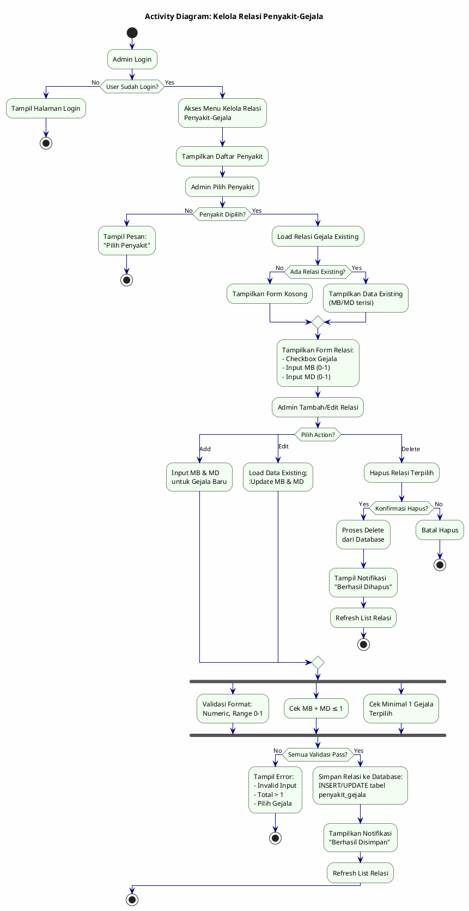

# 🔄 ACTIVITY DIAGRAM: KELOLA RELASI PENYAKIT-GEJALA

## **Deskripsi**
Proses admin dalam mengelola relasi antara penyakit dan gejala beserta nilai Certainty Factor (MB/MD) untuk keperluan sistem diagnosis.

## **Aktor**: Admin

---

## 📊 ELEMEN DIAGRAM

### **1. Titik Mulai (Start Node)**
- **Simbol**: Lingkaran hitam solid
- **Fungsi**: Memulai proses kelola relasi penyakit-gejala

### **2. Activity Nodes (Aktivitas)**
| No | Aktivitas | Deskripsi |
|----|-----------|-----------|
| 1 | Login Admin | Admin melakukan autentikasi ke sistem |
| 2 | Akses Menu Kelola Relasi | Admin memilih menu manajemen relasi penyakit-gejala |
| 3 | Tampilkan Daftar Penyakit | Sistem menampilkan list semua penyakit yang ada |
| 4 | Admin Pilih Penyakit | Admin memilih salah satu penyakit untuk dikelola relasinya |
| 5 | Load Relasi Gejala Existing | Sistem memuat data gejala yang sudah terhubung dengan penyakit terpilih |
| 6 | Tampilkan Form Relasi | Sistem menampilkan form dengan checkbox gejala dan input MB/MD |
| 7 | Admin Tambah/Edit Relasi | Admin menambahkan atau mengubah relasi gejala dengan penyakit |
| 8 | Input Nilai MB (Measure of Belief) | Admin memasukkan nilai kepercayaan (0-1) bahwa gejala mengindikasikan penyakit |
| 9 | Input Nilai MD (Measure of Disbelief) | Admin memasukkan nilai ketidakpercayaan (0-1) bahwa gejala mengindikasikan penyakit |
| 10 | Validasi Input MB/MD | Sistem memvalidasi nilai MB dan MD (range 0-1, MB+MD ≤ 1) |
| 11 | Simpan Relasi ke Database | Sistem menyimpan relasi penyakit-gejala beserta nilai CF |
| 12 | Hapus Relasi | Admin menghapus relasi antara penyakit dan gejala tertentu |
| 13 | Konfirmasi Hapus | Sistem meminta konfirmasi sebelum menghapus relasi |
| 14 | Tampilkan Notifikasi Sukses | Sistem menampilkan pesan berhasil simpan/hapus |
| 15 | Refresh List Relasi | Sistem memperbarui tampilan daftar relasi |

### **3. Decision Nodes (Titik Keputusan)**
| No | Pertanyaan | Branch Yes | Branch No |
|----|------------|------------|-----------|
| 1 | User Sudah Login? | Lanjut ke Dashboard | Tampil Halaman Login |
| 2 | Penyakit Dipilih? | Load Relasi Gejala | Tampil Pesan "Pilih Penyakit" |
| 3 | Ada Relasi Existing? | Tampilkan Data Existing | Tampilkan Form Kosong |
| 4 | Pilih Action? (Add/Edit/Delete) | Proses Sesuai Action | Kembali ke List |
| 5 | Validasi MB/MD Pass? | Lanjut Simpan | Tampil Error Message |
| 6 | MB + MD ≤ 1? | Lanjut Validasi | Tampil Error "Total > 1" |
| 7 | Konfirmasi Hapus? | Proses Delete | Batal Hapus |
| 8 | Minimal 1 Gejala Terpilih? | Lanjut Simpan | Tampil Error "Pilih Gejala" |

### **4. Fork & Join Nodes**
- **Fork**: Memproses validasi MB dan MD secara paralel
- **Join**: Menggabungkan hasil validasi sebelum save

### **5. End Node (Titik Akhir)**
- **Simbol**: Lingkaran hitam dengan border (bullseye)
- **Fungsi**: Mengakhiri proses kelola relasi

---

## 🛣️ ALUR UTAMA (MAIN FLOW)

```
┌─────────────────────────┐
│        START            │
└───────────┬─────────────┘
            ▼
┌─────────────────────────┐
│ 1. Admin Login          │
└───────────┬─────────────┘
            ▼
┌─────────────────────────┐
│ 2. Akses Menu Kelola    │
│    Relasi Penyakit-     │
│    Gejala               │
└───────────┬─────────────┘
            ▼
┌─────────────────────────┐
│ 3. Tampilkan Daftar     │
│    Penyakit             │
└───────────┬─────────────┘
            ▼
┌─────────────────────────┐
│ 4. Admin Pilih Penyakit │
└───────────┬─────────────┘
            ▼
    ┌───────────────────┐
    │ Keputusan 1:      │
    │ Penyakit Dipilih? │
    └─────────┬─────────┘
              │
         ┌────┴────┐
        NO        YES
        │          │
        ▼          ▼
┌───────────┐  ┌─────────────────────────┐
│ Tampil    │  │ 5. Load Relasi Gejala   │
│ Pesan:    │  │    Existing             │
│ "Pilih    │  └───────────┬─────────────┘
│ Penyakit" │              │
└─────┬─────┘              ▼
      │           ┌─────────────────────────┐
      │           │ Keputusan 2:            │
      │           │ Ada Relasi Existing?    │
      │           └─────────┬───────────────┘
      │                     │
      │                ┌────┴────┐
      │               NO        YES
      │               │          │
      │               ▼          ▼
      │       ┌───────────┐ ┌─────────────────────┐
      │       │ Tampilkan │  │ Tampilkan Data      │
      │       │ Form      │  │ Existing (MB/MD)    │
      │       │ Kosong    │  └──────────┬──────────┘
      │       └─────┬─────┘             │
      │             │                   │
      └─────────────┼───────────────────┘
                    │
                    ▼
          ┌─────────────────────────┐
          │ 6. Tampilkan Form       │
          │    Relasi dengan:       │
          │    - Checkbox Gejala    │
          │    - Input MB (0-1)     │
          │    - Input MD (0-1)     │
          └───────────┬─────────────┘
                      │
                      ▼
          ┌─────────────────────────┐
          │ 7. Admin Tambah/Edit    │
          │    Relasi:              │
          │    - Centang Gejala     │
          │    - Isi MB & MD        │
          └───────────┬─────────────┘
                      │
                      ▼
          ┌─────────────────────────┐
          │ Keputusan 3:            │
          │ Pilih Action?           │
          │ (Add/Edit/Delete)       │
          └─────────┬───────────────┘
                    │
         ┌──────────┼──────────┐
         │          │          │
        ADD       EDIT      DELETE
         │          │          │
         ▼          ▼          ▼
┌─────────────┐ ┌─────────┐ ┌─────────────────────┐
│ 8. Input    │ │ Load    │ │ 12. Hapus Relasi    │
│    MB & MD  │ │ Data    │ │     Terpilih        │
│    untuk    │ │ Existing│ └──────────┬──────────┘
│    Gejala   │ └────┬────┘            │
└──────┬──────┘      │                 ▼
       │             │      ┌─────────────────────┐
       │             │      │ Keputusan 6:        │
       │             │      │ Konfirmasi Hapus?   │
       │             │      └──────────┬──────────┘
       │             │                 │
       │             │            ┌────┴────┐
       │             │           NO        YES
       │             │           │          │
       │             │           ▼          ▼
       │             │   ┌───────────┐ ┌───────────────┐
       │             │   │ Batal     │  │ Proses Delete │
       │             │   │ Hapus     │  │ dari DB       │
       │             │   └─────┬─────┘ └───────┬───────┘
       │             │         │               │
       └─────────────┴─────────┘               │
                         │                     │
                         ▼                     ▼
               ┌─────────────────────────────────────┐
               │ 9. Validasi Input MB/MD             │
               │    - Range 0-1                      │
               │    - MB + MD ≤ 1                    │
               └─────────────────┬───────────────────┘
                                 │
                    ┌────────────┼────────────┐
                    │            │            │
                    ▼            ▼            ▼
           ┌─────────────┐ ┌───────────┐ ┌──────────────┐
           │ Keputusan 4:│ │Keputusan 5│ │ Keputusan 7: │
           │ Validasi    │ │ MB+MD≤1?  │ │ Min 1 Gejala │
           │ Pass?       │ │           │ │ Terpilih?    │
           └──────┬──────┘ └─────┬─────┘ └──────┬───────┘
                  │             │               │
             ┌────┴────┐   ┌────┴────┐     ┌────┴────┐
            NO        YES NO        YES   NO        YES
            │          │  │          │     │          │
            ▼          │  ▼          │     ▼          │
     ┌──────────┐      │ ┌──────────┐ │ ┌───────────┐ │
     │ Tampil   │      │ │ Tampil   │ │ │ Tampil    │ │
     │ Error:   │      │ │ Error:   │ │ │ Error:    │ │
     │ Invalid  │      │ │ Total>1  │ │ │ Pilih     │ │
     │ Input    │      │ └────┬─────┘ │ │ Gejala    │ │
     └────┬─────┘      │      │       │ └─────┬─────┘ │
          │            │      │       │       │       │
          └────────────┴──────┴───────┴───────┘       │
                   │                                  │
                   ▼                                  ▼
          ┌────────────────────────────────────────────────┐
          │         LANJUT KE PROSES SIMPAN                │
          └────────────────────┬───────────────────────────┘
                               │
                               ▼
                    ┌──────────────────────┐
                    │ 11. Simpan Relasi    │
                    │     ke Database:     │
                    │ - Insert/Update      │
                    │   tabel              │
                    │   penyakit_gejala    │
                    │ - Simpan MB, MD      │
                    └──────────┬───────────┘
                               │
                               ▼
                    ┌──────────────────────┐
                    │ 14. Tampilkan        │
                    │     Notifikasi       │
                    │     "Berhasil        │
                    │     Disimpan"        │
                    └──────────┬───────────┘
                               │
                               ▼
                    ┌──────────────────────┐
                    │ 15. Refresh List     │
                    │     Relasi           │
                    └──────────┬───────────┘
                               │
                               ▼
                    ┌──────────────────────┐
                    │        END            │
                    └──────────────────────┘
```

---

## 🎯 TITIK KEPUTUSAN DETAIL

### **Decision 1: Penyakit Dipilih?**
- **Kondisi**: Admin harus memilih satu penyakit dari daftar
- **Yes**: Lanjut load relasi gejala yang sudah ada
- **No**: Tampilkan pesan error "Silakan pilih penyakit terlebih dahulu"

### **Decision 2: Ada Relasi Existing?**
- **Kondisi**: Cek apakah penyakit yang dipilih sudah memiliki relasi dengan gejala
- **Yes**: Tampilkan data existing (checkbox checked, nilai MB/MD terisi)
- **No**: Tampilkan form kosong (semua checkbox unchecked)

### **Decision 3: Pilih Action?**
- **Kondisi**: Admin memilih tindakan (Tambah, Edit, atau Hapus)
- **Add**: Form input baru untuk gejala yang belum ada relasi
- **Edit**: Update nilai MB/MD untuk relasi yang sudah ada
- **Delete**: Hapus relasi antara penyakit dan gejala

### **Decision 4: Validasi Pass?**
- **Kondisi**: Validasi format input (numeric, range 0-1)
- **Yes**: Lanjut ke validasi berikutnya
- **No**: Tampilkan error "Nilai harus angka antara 0-1"

### **Decision 5: MB + MD ≤ 1?**
- **Kondisi**: Jumlah MB dan MD tidak boleh lebih dari 1
- **Yes**: Lanjut simpan
- **No**: Tampilkan error "Total MB + MD tidak boleh lebih dari 1"

### **Decision 6: Konfirmasi Hapus?**
- **Kondisi**: Konfirmasi sebelum menghapus data
- **Yes**: Eksekusi delete dari database
- **No**: Batal, kembali ke list

### **Decision 7: Minimal 1 Gejala Terpilih?**
- **Kondisi**: Harus ada minimal 1 gejala yang direlasikan
- **Yes**: Lanjut simpan
- **No**: Tampilkan error "Pilih minimal 1 gejala"

---

## 🏷️ ATURAN BISNIS

### **Validasi MB/MD**:
- **Range Nilai**: 0.0 - 1.0
- **Constraint**: MB + MD ≤ 1.0
- **Default**: MB = 0.8, MD = 0.2 (jika tidak diisi)
- **Presisi**: Maksimal 2 desimal

### **Relasi Penyakit-Gejala**:
- **One-to-Many**: Satu penyakit dapat memiliki banyak gejala
- **Many-to-Many**: Satu gejala dapat terkait dengan banyak penyakit
- **Unique Constraint**: Kombinasi (id_penyakit, id_gejala) harus unik

### **Nilai Certainty Factor**:
- **CF = MB - MD**
- **Interpretasi**:
  - CF > 0.8 : Sangat kuat indikasi
  - CF 0.6-0.8 : Kuat indikasi
  - CF 0.4-0.6 : Cukup kuat
  - CF 0.2-0.4 : Lemah
  - CF ≤ 0.2 : Sangat lemah/tidak ada indikasi

### **Hak Akses**:
- Hanya **Admin** yang dapat mengelola relasi
- User biasa hanya dapat melihat hasil diagnosis

---

## 📝 PLANTUML CODE



---

## 🗄️ STRUKTUR DATABASE TERKAIT

### **Tabel: `penyakit_gejala`**
```sql
CREATE TABLE penyakit_gejala (
    id INT PRIMARY KEY AUTO_INCREMENT,
    id_penyakit INT NOT NULL,
    id_gejala INT NOT NULL,
    mb DECIMAL(5,4) DEFAULT 0.8,
    md DECIMAL(5,4) DEFAULT 0.2,
    created_at TIMESTAMP DEFAULT CURRENT_TIMESTAMP,
    updated_at TIMESTAMP DEFAULT CURRENT_TIMESTAMP ON UPDATE CURRENT_TIMESTAMP,
    FOREIGN KEY (id_penyakit) REFERENCES penyakit(id),
    FOREIGN KEY (id_gejala) REFERENCES gejala(id),
    UNIQUE KEY unique_relasi (id_penyakit, id_gejala),
    CHECK (mb >= 0 AND mb <= 1),
    CHECK (md >= 0 AND md <= 1),
    CHECK (mb + md <= 1)
);
```

---

## 📋 CHECKLIST IMPLEMENTASI

- [ ] Form dengan checkbox daftar gejala
- [ ] Input field untuk MB (slider + numeric input)
- [ ] Input field untuk MD (slider + numeric input)
- [ ] Validasi real-time MB + MD ≤ 1
- [ ] Button: Simpan, Edit, Hapus
- [ ] Modal konfirmasi untuk delete
- [ ] Notifikasi toast untuk sukses/error
- [ ] Refresh otomatis setelah save
- [ ] Display CF calculation preview (CF = MB - MD)
- [ ] Export/import relasi (opsional)

---

**Dibuat oleh**: System Documentation  
**Tanggal**: 2024  
**Versi**: 1.0
