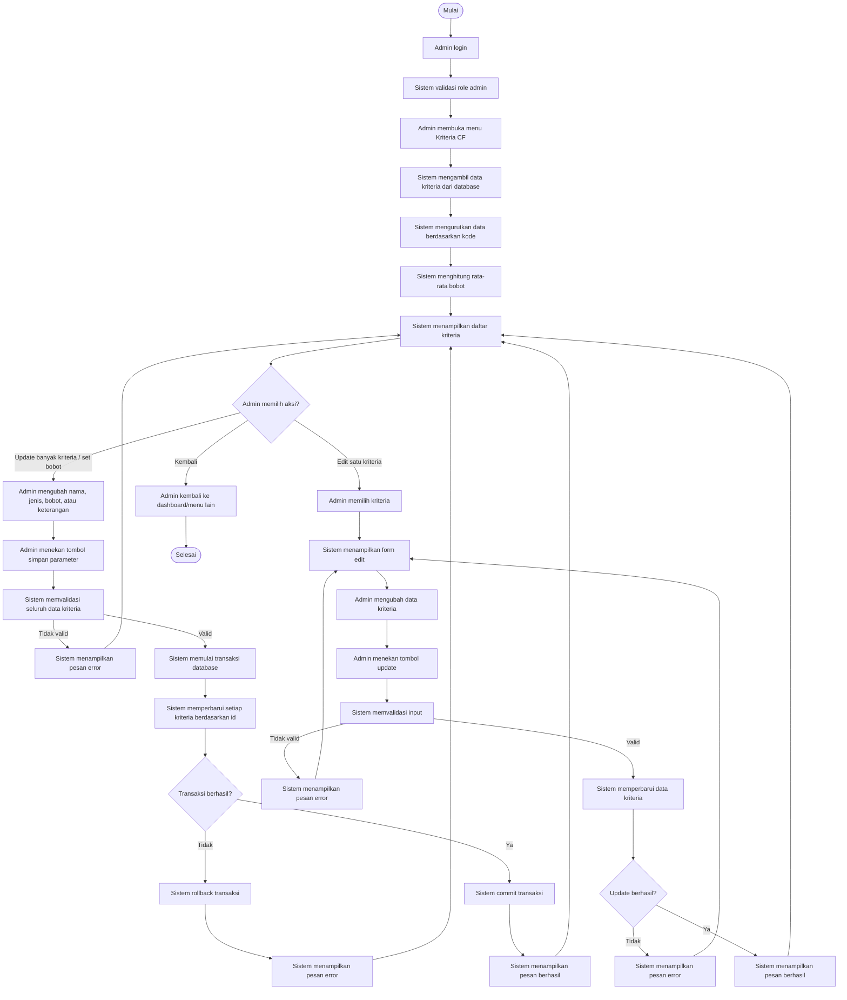

# Informasi Activity Diagram Kelola Kriteria dan Bobot Kriteria

Dokumen ini menjelaskan alur aktivitas **Kelola Kriteria dan Bobot Kriteria** pada sistem PadiCare berdasarkan implementasi Laravel yang ada pada `Admin\KriteriaController`.

## Identitas Aktivitas

| Item | Keterangan |
|---|---|
| Nama aktivitas | Kelola Kriteria dan Bobot Kriteria |
| Aktor utama | Admin |
| Modul | Admin - Kriteria Certainty Factor |
| Controller | `App\Http\Controllers\Admin\KriteriaController` |
| Model | `App\Models\Kriteria` |
| Tabel database | `kriteria` |
| Prefix route | `/admin/kriteria` |
| Hak akses | User login dengan role `admin` |

## Tujuan Aktivitas

Aktivitas ini digunakan admin untuk mengelola parameter kriteria yang dipakai dalam sistem rekomendasi. Kriteria berisi nama parameter, jenis kriteria, bobot, dan keterangan. Bobot kriteria digunakan sistem sebagai parameter prioritas untuk menyesuaikan hasil rekomendasi berdasarkan preferensi pengguna.

Dalam proyek ini, pengelolaan kriteria dan set bobot berada pada satu modul yang sama. Admin dapat memperbarui beberapa kriteria sekaligus melalui halaman daftar atau memperbarui satu kriteria melalui form edit individual.

## Swimlane yang Disarankan

Activity diagram dapat dibuat dengan swimlane berikut:

| Swimlane | Peran |
|---|---|
| Admin | Membuka menu kriteria, mengubah data kriteria, mengatur bobot, menekan simpan/update |
| Sistem | Menampilkan daftar, menghitung rata-rata bobot, memvalidasi input, memproses update, menampilkan pesan |
| Database | Mengambil data kriteria, memperbarui data kriteria, menyimpan perubahan bobot |

## Data yang Dikelola

| Field | Keterangan | Validasi Utama |
|---|---|---|
| kode | Kode kriteria | Tersimpan di database, digunakan sebagai identitas kriteria |
| nama | Nama kriteria | Wajib, maksimal 100 karakter |
| jenis | Jenis kriteria | Wajib, hanya `benefit` atau `cost` |
| bobot | Nilai bobot kriteria | Wajib, numerik, minimal 0, maksimal 1 |
| keterangan | Penjelasan kriteria | Opsional |

## Alur Utama Menampilkan Kriteria

1. Admin login ke sistem.
2. Sistem memeriksa autentikasi dan role admin.
3. Admin membuka menu **Kriteria CF** atau **Kelola Kriteria**.
4. Sistem mengambil semua data kriteria dari database.
5. Sistem mengurutkan data berdasarkan `kode`.
6. Sistem menghitung rata-rata bobot kriteria.
7. Sistem menampilkan daftar kriteria, jenis, bobot, dan keterangan.
8. Admin memilih aksi: update banyak kriteria sekaligus, edit satu kriteria, atau kembali ke dashboard/menu lain.

## Alur Set Bobot dan Update Banyak Kriteria

Alur ini sesuai dengan method `updateBulk`.

1. Admin membuka halaman daftar kriteria.
2. Sistem menampilkan semua kriteria dalam form daftar.
3. Admin mengubah nama, jenis, bobot, atau keterangan pada satu atau beberapa kriteria.
4. Admin menekan tombol simpan/update parameter.
5. Sistem memvalidasi seluruh data kriteria.
6. Sistem mengecek apakah data kriteria berbentuk array.
7. Sistem mengecek nama setiap kriteria.
8. Sistem mengecek jenis setiap kriteria, harus `benefit` atau `cost`.
9. Sistem mengecek bobot setiap kriteria, harus angka dari 0 sampai 1.
10. Sistem mengecek keterangan, boleh kosong.
11. Jika ada data tidak valid, sistem menampilkan pesan error dan mengembalikan admin ke halaman kriteria.
12. Jika semua data valid, sistem memulai transaksi database.
13. Sistem mencari setiap kriteria berdasarkan id.
14. Jika kriteria ditemukan, sistem memperbarui nama, jenis, bobot, dan keterangan.
15. Sistem membulatkan bobot menjadi dua angka desimal.
16. Jika semua update berhasil, sistem melakukan commit transaksi.
17. Sistem menampilkan pesan berhasil.
18. Sistem mengarahkan admin kembali ke daftar kriteria terbaru.
19. Jika terjadi kesalahan database, sistem melakukan rollback transaksi.
20. Sistem menampilkan pesan error gagal memperbarui data.

## Alur Edit Satu Kriteria

Alur ini sesuai dengan method `edit` dan `update`.

1. Admin membuka halaman daftar kriteria.
2. Admin memilih salah satu kriteria untuk diedit.
3. Sistem mengambil data kriteria yang dipilih dari database.
4. Sistem menampilkan form edit kriteria individual.
5. Admin mengubah nama, jenis, bobot, atau keterangan.
6. Admin menekan tombol update.
7. Sistem memvalidasi input.
8. Jika nama kosong atau lebih dari 100 karakter, sistem menampilkan pesan error.
9. Jika jenis bukan `benefit` atau `cost`, sistem menampilkan pesan error.
10. Jika bobot bukan angka atau tidak berada pada rentang 0 sampai 1, sistem menampilkan pesan error.
11. Jika data valid, sistem memperbarui data kriteria di database.
12. Jika update berhasil, sistem menampilkan pesan berhasil.
13. Sistem mengarahkan admin kembali ke daftar kriteria.
14. Jika update gagal, sistem menampilkan pesan error dan tetap berada pada form edit.

## Titik Keputusan untuk Activity Diagram

| Keputusan | Cabang |
|---|---|
| Admin memilih aksi? | Update banyak kriteria, edit satu kriteria, kembali |
| Data kriteria lengkap? | Ya: lanjut validasi, Tidak: tampilkan error |
| Jenis valid? | Ya: lanjut, Tidak: tampilkan error |
| Bobot valid? | Ya: lanjut, Tidak: tampilkan error |
| Bobot berada pada 0 sampai 1? | Ya: lanjut simpan, Tidak: tampilkan error |
| Kriteria ditemukan berdasarkan id? | Ya: update data, Tidak: lewati/id tidak diproses |
| Transaksi database berhasil? | Ya: commit dan pesan sukses, Tidak: rollback dan pesan error |
| Update individual berhasil? | Ya: pesan sukses, Tidak: pesan error |

## Model Activity Diagram yang Disarankan

## Catatan Kesesuaian dengan Sistem

Pada implementasi saat ini, modul kriteria tidak memiliki proses tambah dan hapus kriteria melalui controller. Aktivitas utama yang tersedia adalah menampilkan daftar kriteria, memperbarui banyak kriteria sekaligus melalui `updateBulk`, dan memperbarui satu kriteria melalui `update`.

Nilai bobot dibatasi dari 0 sampai 1. Pada proses update banyak kriteria, bobot dibulatkan menjadi dua angka desimal sebelum disimpan. Proses update banyak kriteria menggunakan transaksi database, sehingga jika terjadi kesalahan, perubahan dibatalkan melalui rollback.

## Ringkasan Alur Activity

Admin membuka menu kriteria, kemudian sistem mengambil dan menampilkan daftar kriteria dari database. Admin dapat mengubah beberapa kriteria sekaligus, termasuk bobotnya, lalu menyimpan perubahan. Sistem memvalidasi semua input dan menyimpan perubahan dalam transaksi database. Admin juga dapat memilih satu kriteria untuk diedit secara individual. Jika data valid, sistem memperbarui data kriteria dan menampilkan pesan berhasil. Jika data tidak valid atau proses database gagal, sistem menampilkan pesan error.

