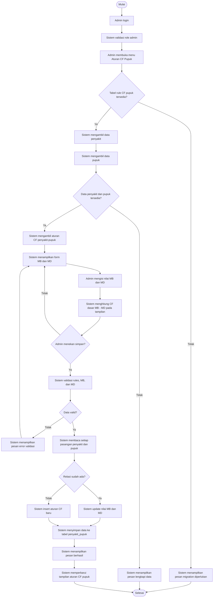

# Informasi Activity Diagram Kelola Nilai CF Pupuk

Dokumen ini menjelaskan alur aktivitas **Kelola Nilai CF Pupuk** pada sistem PadiCare berdasarkan implementasi Laravel yang ada pada `Admin\RatingController`, khususnya method `pupuk` dan `simpanPupuk`.

## Identitas Aktivitas

| Item | Keterangan |
|---|---|
| Nama aktivitas | Kelola Nilai CF Pupuk |
| Aktor utama | Admin |
| Modul | Admin - Aturan CF Pupuk |
| Controller | `App\Http\Controllers\Admin\RatingController` |
| Method tampil data | `pupuk()` |
| Method simpan data | `simpanPupuk()` |
| Model utama | `App\Models\PenyakitPupuk` |
| Model pendukung | `App\Models\Penyakit`, `App\Models\Pupuk` |
| Tabel database | `penyakit_pupuk` |
| Prefix route | `/admin/rating/pupuk` |
| Hak akses | User login dengan role `admin` |

## Tujuan Aktivitas

Aktivitas ini digunakan admin untuk mengelola nilai **Certainty Factor** pada hubungan antara penyakit padi dan pupuk. Nilai yang diinput admin bukan langsung nilai CF akhir, tetapi nilai **MB** dan **MD**.

Nilai CF dasar dihitung dengan rumus:

```text
CF = MB - MD
```

Keterangan:

| Komponen | Keterangan |
|---|---|
| MB | Measure of Belief, tingkat keyakinan bahwa pupuk sesuai untuk penyakit tertentu |
| MD | Measure of Disbelief, tingkat ketidakyakinan bahwa pupuk sesuai untuk penyakit tertentu |
| CF | Nilai dasar rekomendasi pupuk, diperoleh dari MB dikurangi MD |

Nilai ini digunakan sistem rekomendasi untuk menentukan pupuk mana yang layak direkomendasikan pada penyakit tertentu.

## Swimlane yang Disarankan

Activity diagram dapat dibuat dengan swimlane berikut:

| Swimlane | Peran |
|---|---|
| Admin | Membuka menu aturan CF pupuk, memilih/filter penyakit, mengisi MB dan MD, mereset nilai, menyimpan aturan |
| Sistem | Mengecek tabel rule, mengambil data penyakit dan pupuk, menampilkan form, menghitung CF dasar, validasi input, menyimpan aturan |
| Database | Menyediakan data penyakit, pupuk, dan aturan CF penyakit-pupuk |

## Data yang Dikelola

| Field | Keterangan | Validasi Utama |
|---|---|---|
| id_penyakit | ID penyakit padi | Diambil dari daftar penyakit |
| id_pupuk | ID pupuk | Diambil dari daftar pupuk |
| mb | Nilai Measure of Belief | Wajib, numerik, minimal 0, maksimal 1 |
| md | Nilai Measure of Disbelief | Wajib, numerik, minimal 0, maksimal 1 |
| cf dasar | Hasil perhitungan MB - MD | Ditampilkan di form, tidak disimpan sebagai field terpisah |

## Alur Utama Menampilkan Nilai CF Pupuk

1. Admin login ke sistem.
2. Sistem memeriksa autentikasi dan role admin.
3. Admin membuka menu **Aturan CF Pupuk**.
4. Sistem mengecek apakah tabel rule CF pupuk tersedia.
5. Sistem mengambil data penyakit dari database.
6. Sistem mengambil data pupuk dari database.
7. Sistem mengambil data aturan CF dari tabel `penyakit_pupuk`.
8. Sistem membuat key relasi berdasarkan kombinasi `id_penyakit` dan `id_pupuk`.
9. Sistem menampilkan halaman input rule CF pupuk.
10. Jika tabel rule belum tersedia, sistem menampilkan pesan bahwa migration database perlu dijalankan.
11. Jika data penyakit atau pupuk kosong, sistem menampilkan pesan agar admin melengkapi data penyakit dan pupuk terlebih dahulu.
12. Jika data siap, sistem menampilkan daftar penyakit dan pupuk beserta input MB dan MD.

## Alur Input dan Perhitungan CF Dasar

1. Admin memilih atau melihat kelompok penyakit.
2. Sistem menampilkan daftar pupuk untuk penyakit tersebut.
3. Admin mengisi nilai MB pada relasi penyakit-pupuk.
4. Admin mengisi nilai MD pada relasi penyakit-pupuk.
5. Sistem menghitung CF dasar secara otomatis pada tampilan.
6. Sistem menampilkan hasil CF dasar dengan rumus `MB - MD`.
7. Jika admin menekan tombol reset, sistem mengembalikan nilai ke default MB `0.700` dan MD `0.100`.
8. Admin dapat menggunakan filter penyakit untuk memudahkan input.
9. Admin dapat membuka atau menyembunyikan seluruh daftar penyakit.

## Alur Simpan Nilai CF Pupuk

1. Admin mengisi atau memperbarui nilai MB dan MD.
2. Admin menekan tombol **Simpan Aturan CF Pupuk**.
3. Sistem mengecek kembali apakah tabel rule CF pupuk tersedia.
4. Jika tabel belum tersedia, sistem menampilkan pesan error.
5. Sistem memvalidasi data `rules`.
6. Sistem memastikan `rules` berbentuk array.
7. Sistem memastikan setiap nilai MB wajib diisi, numerik, minimal 0, dan maksimal 1.
8. Sistem memastikan setiap nilai MD wajib diisi, numerik, minimal 0, dan maksimal 1.
9. Jika data tidak valid, sistem menampilkan pesan error validasi.
10. Jika data valid, sistem membaca setiap kombinasi penyakit dan pupuk.
11. Sistem menyimpan atau memperbarui data menggunakan `updateOrCreate`.
12. Jika kombinasi penyakit-pupuk belum ada, sistem membuat record baru.
13. Jika kombinasi penyakit-pupuk sudah ada, sistem memperbarui nilai MB dan MD.
14. Sistem membulatkan nilai MB dan MD menjadi tiga angka desimal.
15. Sistem menyimpan data ke tabel `penyakit_pupuk`.
16. Sistem menampilkan pesan berhasil.
17. Sistem mengarahkan admin kembali ke halaman aturan CF pupuk.

## Titik Keputusan untuk Activity Diagram

| Keputusan | Cabang |
|---|---|
| Admin sudah login sebagai admin? | Ya: lanjut, Tidak: arahkan login/tolak akses |
| Tabel rule CF pupuk tersedia? | Ya: tampilkan form, Tidak: tampilkan pesan migration |
| Data penyakit tersedia? | Ya: lanjut, Tidak: tampilkan pesan lengkapi data penyakit |
| Data pupuk tersedia? | Ya: lanjut, Tidak: tampilkan pesan lengkapi data pupuk |
| Admin menyimpan data? | Ya: validasi dan simpan, Tidak: tetap di halaman input |
| Nilai MB valid? | Ya: lanjut, Tidak: tampilkan error |
| Nilai MD valid? | Ya: lanjut, Tidak: tampilkan error |
| Relasi penyakit-pupuk sudah ada? | Ya: update data, Tidak: insert data baru |
| Proses simpan berhasil? | Ya: pesan sukses, Tidak: pesan error |

## Model Activity Diagram yang Disarankan



## Catatan Kesesuaian dengan Sistem

Pada implementasi saat ini, nilai CF pupuk tidak disimpan langsung sebagai kolom `cf`. Sistem menyimpan nilai `mb` dan `md`, lalu nilai CF dasar ditampilkan dan dihitung dari:

```text
CF = MB - MD
```

Relasi yang dikelola adalah relasi antara penyakit dan pupuk pada tabel `penyakit_pupuk`. Proses simpan menggunakan `updateOrCreate`, sehingga satu kombinasi penyakit dan pupuk dapat diperbarui jika sudah ada, atau dibuat baru jika belum ada.

Nilai default pada tampilan adalah:

| Nilai | Default |
|---|---|
| MB | 0.700 |
| MD | 0.100 |
| CF dasar | 0.600 |

## Ringkasan Alur Activity

Admin membuka menu aturan CF pupuk. Sistem memeriksa kesiapan tabel rule, mengambil data penyakit, pupuk, dan aturan CF yang sudah ada. Jika data siap, sistem menampilkan form input MB dan MD untuk setiap kombinasi penyakit-pupuk. Admin mengisi nilai MB dan MD, lalu sistem menghitung CF dasar pada tampilan. Saat admin menyimpan, sistem memvalidasi nilai MB dan MD agar berada pada rentang 0 sampai 1. Jika valid, sistem menyimpan atau memperbarui aturan CF ke tabel `penyakit_pupuk`, lalu menampilkan pesan berhasil.

