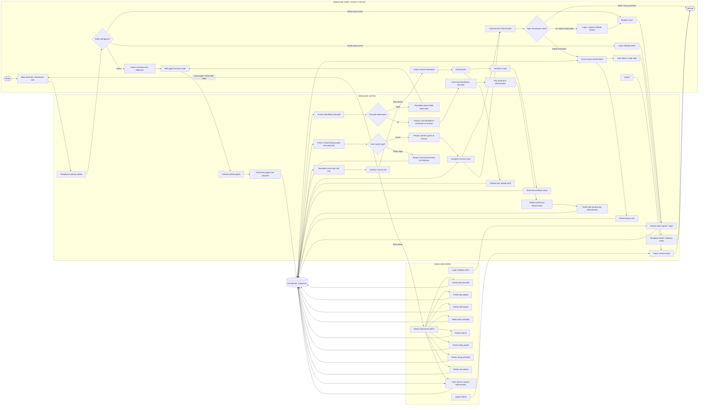

# Flowchart Swimlane Sistem PadiCare

Dokumen ini menggambarkan alur sistem PadiCare berdasarkan struktur proyek Laravel yang ada. Flowchart dibagi menjadi tiga swimlane utama, yaitu **User**, **Sistem**, dan **Admin**, dengan satu **Database** sebagai pusat penyimpanan data.

Flowchart ini juga memasukkan alur **guest user**, yaitu pengguna yang belum login tetapi tetap dapat melakukan diagnosis dan melihat preview rekomendasi.

## Flowchart Utama

## Penjelasan Alur

### 1. Alur Guest User

Guest user adalah pengguna yang belum login. Pada proyek ini, guest tetap dapat membuka halaman utama, masuk ke fitur diagnosis, memilih gejala tanaman padi, melihat hasil identifikasi penyakit, memilih preferensi rekomendasi, dan melihat preview rekomendasi.

Perbedaan utamanya adalah hasil guest tidak disimpan permanen ke database. Sistem hanya menyimpan hasil sementara di session. Jika guest ingin menyimpan hasil diagnosis ke riwayat, pengguna harus register atau login sebagai petani terlebih dahulu.

### 2. Alur User Login / Petani

Petani dapat melakukan register, login, mengelola profil, dan melakukan verifikasi email. Setelah login, petani dapat menjalankan diagnosis seperti guest, tetapi hasil rekomendasi akan disimpan ke database.

Hasil yang sudah tersimpan dapat dibuka kembali melalui menu riwayat, dilihat detailnya, dan dicetak sebagai laporan rekomendasi pupuk serta pestisida.

### 3. Alur Sistem

Sistem bertugas sebagai penghubung antara user, admin, dan database. Sistem melakukan validasi input, autentikasi, pengecekan role, pengambilan data gejala dan penyakit, pemrosesan identifikasi penyakit, pemrosesan rekomendasi pupuk dan pestisida, penyimpanan session untuk guest, serta penyimpanan riwayat untuk user login.

Pada flowchart ini, proses perhitungan dibuat secara umum sebagai "proses identifikasi" dan "proses rekomendasi", tanpa memasukkan rumus atau detail perhitungan.

### 4. Alur Admin

Admin masuk melalui login admin dan diarahkan ke dashboard admin. Dari dashboard, admin dapat mengelola data master yang dibutuhkan sistem, yaitu penyakit, gejala, pupuk, pestisida, kriteria, rating pupuk, rating pestisida, user petani, dan riwayat rekomendasi.

Semua perubahan dari admin langsung berhubungan dengan database tunggal. Data inilah yang digunakan sistem saat user melakukan diagnosis dan meminta rekomendasi.

## Database Tunggal

Database pada flowchart ini dibuat sebagai satu pusat data. Database menyimpan data berikut:

| Kelompok Data | Isi Data |
|---|---|
| User | akun petani, akun admin, profil, password, status verifikasi email |
| Data penyakit | daftar penyakit padi dan informasinya |
| Data gejala | daftar gejala dan relasi gejala dengan penyakit |
| Data produk | data pupuk dan pestisida |
| Data pendukung rekomendasi | kriteria, rating pupuk, rating pestisida |
| Data hasil | rekomendasi, detail rekomendasi pupuk, detail rekomendasi pestisida |

## Ringkasan Alur End-to-End

Alur sistem dimulai ketika pengguna membuka beranda. Jika pengguna belum login, pengguna tetap bisa melakukan diagnosis sebagai guest dan melihat preview rekomendasi. Sistem mengambil data gejala dan penyakit dari database, memproses identifikasi, lalu menghasilkan rekomendasi berdasarkan data pendukung yang sudah dikelola admin. Untuk guest, hasil hanya disimpan sementara di session.

Jika pengguna login sebagai petani, hasil rekomendasi disimpan ke database sehingga dapat dilihat kembali melalui riwayat. Di sisi lain, admin bertugas menyiapkan dan memperbarui data master, data kriteria, rating, user, serta memantau riwayat rekomendasi. Dengan demikian, user memberikan input, sistem memproses keputusan, admin mengelola data, dan database tunggal menjadi pusat penyimpanan seluruh data permanen.
