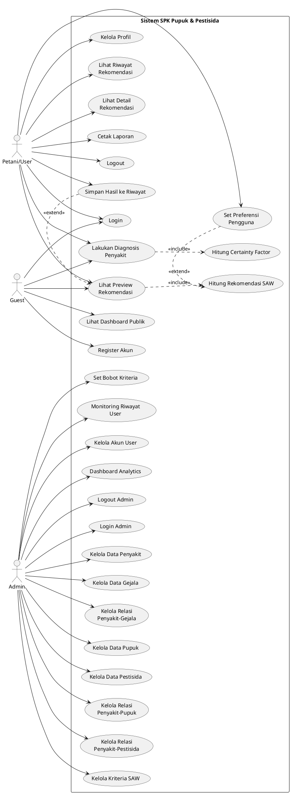

# 📊 USE CASE DIAGRAM - SISTEM SPK PUPUK & PESTISIDA PADI

## 🎯 INFORMASI UMUM
- **Nama Sistem**: Sistem Pendukung Keputusan Rekomendasi Pupuk & Pestisida Padi
- **Metode**: Certainty Factor (CF) + Simple Additive Weighting (SAW)
- **Framework**: Laravel 11
- **Database**: MySQL/MariaDB

---

## 👥 AKTOR SISTEM

### 1. **Guest** (Pengunjung Belum Login)
**Deskripsi**: Pengguna yang belum melakukan autentikasi

**Use Cases**:
- ✅ **UC-001: Lihat Dashboard Publik**
  - Deskripsi: Mengakses halaman utama dengan informasi sistem
  - Precondition: Tidak ada
  - Postcondition: Menampilkan statistik umum
  
- ✅ **UC-002: Lakukan Diagnosis Penyakit**
  - Deskripsi: Memilih gejala dan input bobot keyakinan (0-100%)
  - Precondition: Akses halaman diagnosis
  - Postcondition: Menampilkan hasil identifikasi penyakit
  - Includes: UC-003 (Hitung Certainty Factor)
  
- ✅ **UC-003: Hitung Certainty Factor**
  - Deskripsi: Sistem menghitung nilai CF dari gejala yang dipilih
  - Precondition: User memilih minimal 1 gejala
  - Postcondition: Menampilkan persentase keyakinan penyakit
  
- ✅ **UC-004: Lihat Preview Rekomendasi**
  - Deskripsi: Melihat rekomendasi pupuk & pestisida (mode preview)
  - Precondition: Hasil diagnosis tersedia
  - Postcondition: Menampilkan list pupuk & pestisida dengan ranking
  - Includes: UC-005 (Hitung SAW)
  
- ✅ **UC-005: Hitung Rekomendasi SAW**
  - Deskripsi: Sistem menghitung ranking alternatif dengan metode SAW
  - Precondition: Ada penyakit teridentifikasi
  - Postcondition: Ranking pupuk & pestisida
  
- ✅ **UC-006: Register Akun**
  - Deskripsi: Membuat akun baru sebagai petani
  - Precondition: Belum punya akun
  - Postcondition: Akun dibuat, perlu verifikasi email

---

### 2. **Petani/User** (Sudah Login)
**Deskripsi**: Pengguna terdaftar dengan role 'petani'

**Use Cases** (Semua use case Guest + berikut):
- ✅ **UC-010: Login**
  - Deskripsi: Autentikasi dengan username/email
  - Precondition: Sudah register
  - Postcondition: Session login aktif
  
- ✅ **UC-011: Kelola Profil**
  - Deskripsi: Edit data pribadi (nama, alamat, foto, dll)
  - Precondition: Login
  - Postcondition: Data user terupdate
  
- ✅ **UC-012: Simpan Hasil ke Riwayat**
  - Deskripsi: Menyimpan hasil diagnosis & rekomendasi ke database
  - Precondition: Login + ada hasil diagnosis
  - Postcondition: Data tersimpan di tabel `rekomendasi`
  - Extends: UC-004
  
- ✅ **UC-013: Lihat Riwayat Rekomendasi**
  - Deskripsi: Mengakses daftar semua rekomendasi yang pernah dibuat
  - Precondition: Login
  - Postcondition: Menampilkan list riwayat dengan tanggal
  
- ✅ **UC-014: Lihat Detail Rekomendasi**
  - Deskripsi: Melihat detail lengkap satu kasus (penyakit, pupuk, pestisida)
  - Precondition: Ada ID rekomendasi
  - Postcondition: Menampilkan detail lengkap + nilai Vi
  
- ✅ **UC-015: Cetak Laporan**
  - Deskripsi: Export hasil rekomendasi ke PDF/print
  - Precondition: Ada detail rekomendasi
  - Postcondition: File PDF/download
  
- ✅ **UC-016: Set Preferensi Pengguna**
  - Deskripsi: Memilih prioritas: Seimbang/Hemat/Efisiensi
  - Precondition: Akan melakukan rekomendasi
  - Postcondition: Bobot kriteria disesuaikan
  
- ✅ **UC-017: Logout**
  - Deskripsi: Mengakhiri session login
  - Precondition: Login
  - Postcondition: Session dihancurkan

---

### 3. **Admin**
**Deskripsi**: Administrator dengan role 'admin'

**Use Cases**:
- ✅ **UC-020: Login Admin**
  - Deskripsi: Autentikasi sebagai admin
  - Precondition: Akun admin exists
  - Postcondition: Session admin aktif
  
- ✅ **UC-021: Kelola Data Penyakit**
  - Deskripsi: CRUD penyakit padi (kode, nama, deskripsi, gambar)
  - Precondition: Login admin
  - Postcondition: Data penyakit terupdate
  
- ✅ **UC-022: Kelola Data Gejala**
  - Deskripsi: CRUD gejala (kode, nama, gambar)
  - Precondition: Login admin
  - Postcondition: Data gejala terupdate
  
- ✅ **UC-023: Kelola Relasi Penyakit-Gejala**
  - Deskripsi: Set nilai MB/MD untuk setiap relasi penyakit-gejala
  - Precondition: Penyakit & gejala exists
  - Postcondition: Aturan CF tersimpan di `penyakit_gejala`
  
- ✅ **UC-024: Kelola Data Pupuk**
  - Deskripsi: CRUD pupuk (kode, nama, kandungan, harga, dll)
  - Precondition: Login admin
  - Postcondition: Data pupuk terupdate
  
- ✅ **UC-025: Kelola Data Pestisida**
  - Deskripsi: CRUD pestisida (kode, nama, jenis, bahan aktif, dosis)
  - Precondition: Login admin
  - Postcondition: Data pestisida terupdate
  
- ✅ **UC-026: Kelola Relasi Penyakit-Pupuk**
  - Deskripsi: Set nilai MB/MD kesesuaian pupuk untuk penyakit
  - Precondition: Penyakit & pupuk exists
  - Postcondition: Aturan CF tersimpan di `penyakit_pupuk`
  
- ✅ **UC-027: Kelola Relasi Penyakit-Pestisida**
  - Deskripsi: Set nilai MB/MD efektivitas pestisida untuk penyakit
  - Precondition: Penyakit & pestisida exists
  - Postcondition: Aturan CF tersimpan di `penyakit_pestisida`
  
- ✅ **UC-028: Kelola Kriteria SAW**
  - Deskripsi: CRUD kriteria (Harga, Ketersediaan, Efektivitas, dll)
  - Precondition: Login admin
  - Postcondition: Data kriteria terupdate
  
- ✅ **UC-029: Set Bobot Kriteria**
  - Deskripsi: Menentukan bobot dan jenis (benefit/cost) per kriteria
  - Precondition: Kriteria exists
  - Postcondition: Bobot tersimpan di tabel `kriteria`
  
- ✅ **UC-030: Monitoring Riwayat User**
  - Deskripsi: Melihat semua riwayat rekomendasi seluruh user
  - Precondition: Login admin
  - Postcondition: Menampilkan list global riwayat
  
- ✅ **UC-031: Kelola Akun User**
  - Deskripsi: View, edit, disable/enable akun pengguna
  - Precondition: Login admin
  - Postcondition: Status/user data terupdate
  
- ✅ **UC-032: Dashboard Analytics**
  - Deskripsi: Statistik penggunaan sistem (diagnosis terbanyak, dll)
  - Precondition: Login admin
  - Postcondition: Menampilkan chart & statistik
  
- ✅ **UC-033: Logout Admin**
  - Deskripsi: Mengakhiri session admin
  - Precondition: Login admin
  - Postcondition: Session dihancurkan

---

## 🔗 RELASI USE CASE

### Include Relationships:
```
UC-002 (Diagnosis) → includes → UC-003 (Hitung CF)
UC-004 (Preview Rekomendasi) → includes → UC-005 (Hitung SAW)
UC-012 (Simpan Riwayat) → extends → UC-004 (Preview)
```

### Extend Relationships:
```
UC-012 (Simpan Riwayat) ← extends ← UC-004 (Preview) [jika user login]
UC-016 (Set Preferensi) ← extends ← UC-005 (Hitung SAW)
```

### Generalization:
```
          ┌─────────────┐
          │    USER     │
          └──────┬──────┘
                 │
        ┌────────┴────────┐
        │                 │
   ┌────▼────┐      ┌────▼────┐
   │  Guest  │      │ Petani  │
   └─────────┘      └─────────┘
   
          ┌─────────────┐
          │  AUTHENTICATED│
          └──────┬──────┘
                 │
        ┌────────┴────────┐
        │                 │
   ┌────▼────┐      ┌────▼────┐
   │ Petani  │      │  Admin  │
   └─────────┘      └─────────┘
```

---

## 📋 DAFTAR USE CASE LENGKAP

| ID | Use Case | Aktor | Prioritas |
|----|----------|-------|-----------|
| UC-001 | Lihat Dashboard Publik | Guest | High |
| UC-002 | Lakukan Diagnosis Penyakit | Guest, Petani | High |
| UC-003 | Hitung Certainty Factor | System | High |
| UC-004 | Lihat Preview Rekomendasi | Guest, Petani | High |
| UC-005 | Hitung Rekomendasi SAW | System | High |
| UC-006 | Register Akun | Guest | Medium |
| UC-010 | Login | Guest, Petani, Admin | High |
| UC-011 | Kelola Profil | Petani | Medium |
| UC-012 | Simpan Hasil ke Riwayat | Petani | High |
| UC-013 | Lihat Riwayat Rekomendasi | Petani | High |
| UC-014 | Lihat Detail Rekomendasi | Petani, Admin | High |
| UC-015 | Cetak Laporan | Petani | Medium |
| UC-016 | Set Preferensi Pengguna | Petani | Medium |
| UC-017 | Logout | Petani, Admin | Low |
| UC-020 | Login Admin | Admin | High |
| UC-021 | Kelola Data Penyakit | Admin | High |
| UC-022 | Kelola Data Gejala | Admin | High |
| UC-023 | Kelola Relasi Penyakit-Gejala | Admin | High |
| UC-024 | Kelola Data Pupuk | Admin | High |
| UC-025 | Kelola Data Pestisida | Admin | High |
| UC-026 | Kelola Relasi Penyakit-Pupuk | Admin | High |
| UC-027 | Kelola Relasi Penyakit-Pestisida | Admin | High |
| UC-028 | Kelola Kriteria SAW | Admin | High |
| UC-029 | Set Bobot Kriteria | Admin | High |
| UC-030 | Monitoring Riwayat User | Admin | Medium |
| UC-031 | Kelola Akun User | Admin | Medium |
| UC-032 | Dashboard Analytics | Admin | Medium |
| UC-033 | Logout Admin | Admin | Low |

---

## 🎨 DIAGRAM VISUAL (PlantUML Format)



---

## 📝 CATATAN PENTING

1. **Guest vs Logged-in User**:
   - Guest hanya bisa preview (session temporary)
   - Logged-in user bisa simpan permanen ke database

2. **Certainty Factor Flow**:
   - Input: Gejala + Bobot keyakinan (0-100%)
   - Process: CF = (MB - MD) * user_weight
   - Output: Persentase keyakinan penyakit

3. **SAW Flow**:
   - Input: Penyakit terdiagnosis + Preferensi user
   - Process: Normalisasi matriks → Nilai Vi
   - Output: Ranking pupuk & pestisida

4. **Admin Authority**:
   - Hanya admin yang bisa manage master data
   - Admin bisa view semua data user
   - Admin tidak bisa melakukan diagnosis (hanya monitoring)

---

**Dibuat**: 2025
**Versi**: 1.0
**Status**: Final
